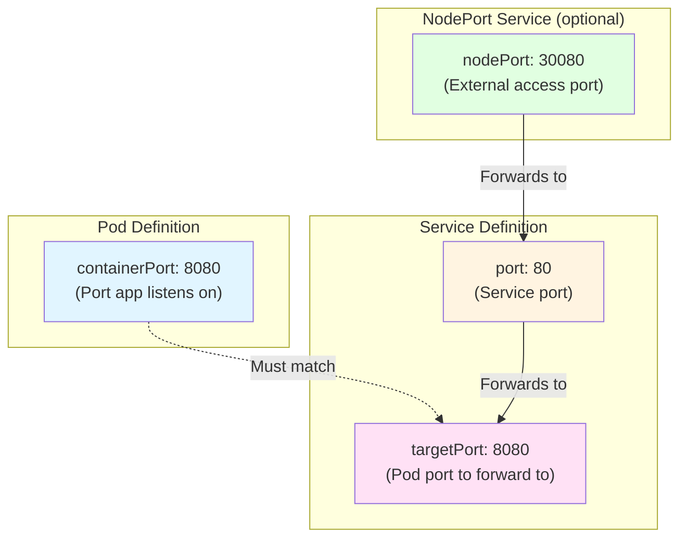
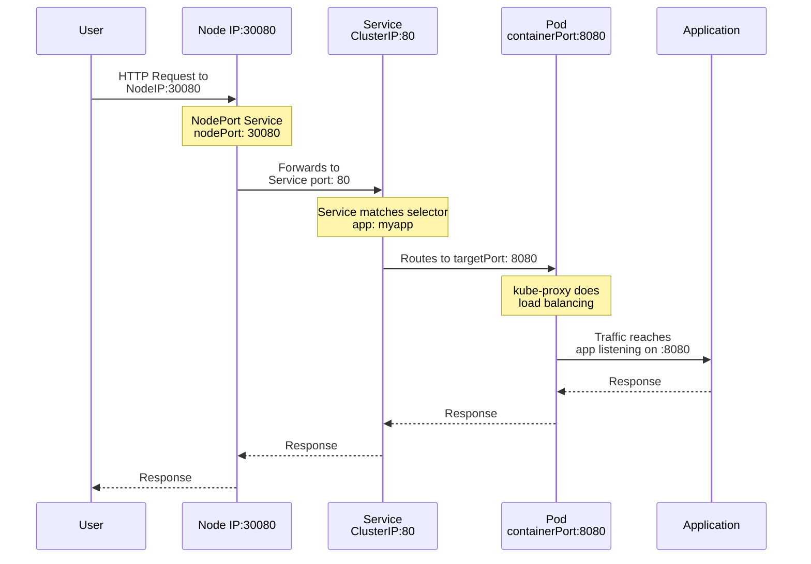
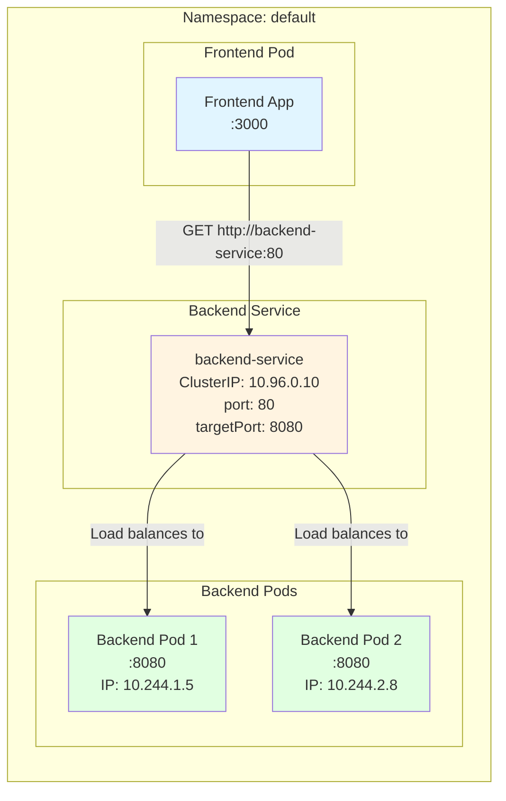
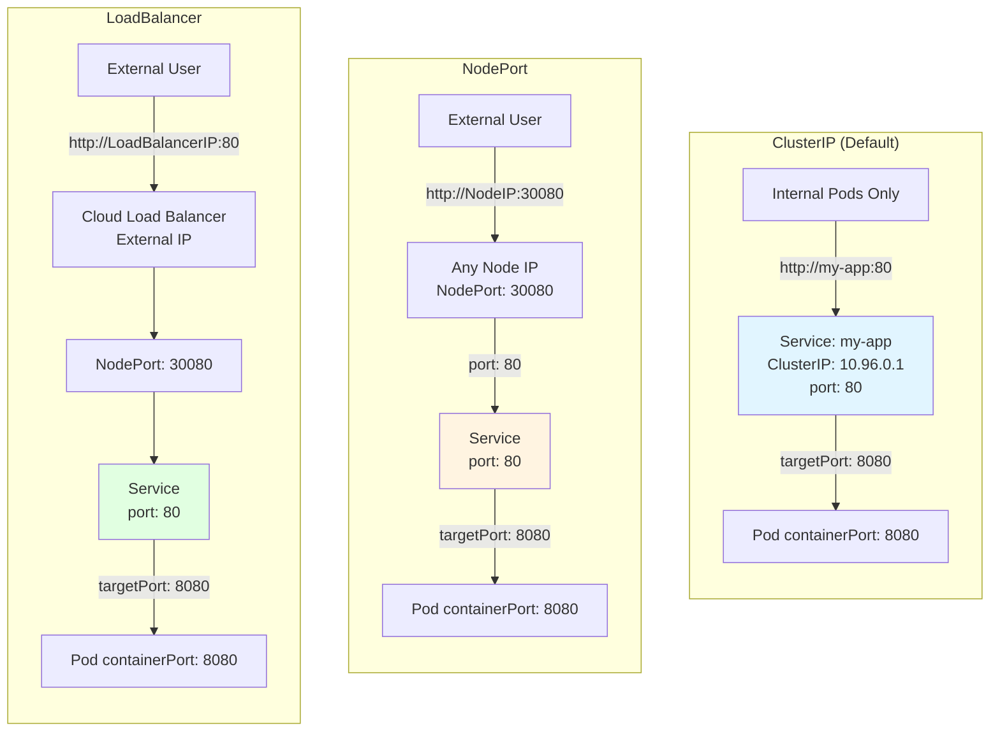
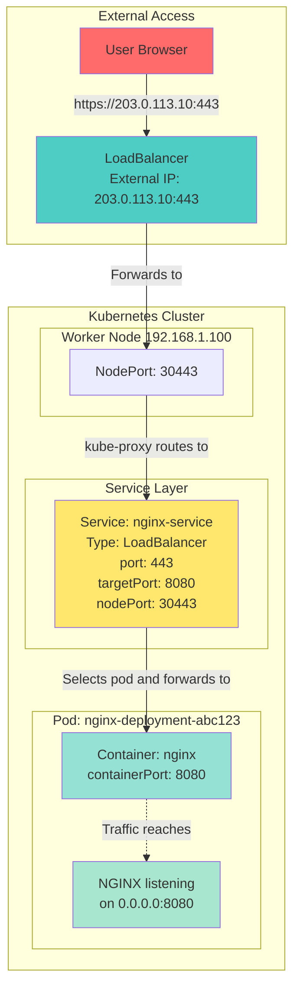
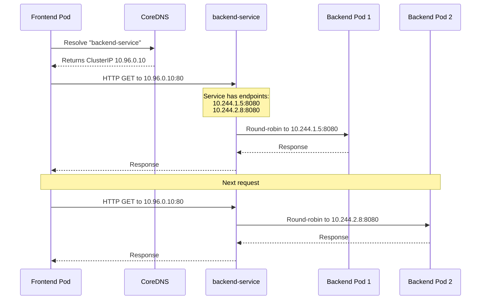

# Service ports in k8s

> `targetPort` must equal `containerPort`

`nodePort -> port -> targetPort = containerPort`



## 1. **External Traffic Flow (User → Pod)**



## 2. **ClusterIP Service (Inter-Pod Communication)**



## 3. **All Service Types Comparison**



## 4. **Real Example with All Port Numbers**



## Key Concepts Explained

### **Port Types:**

1. **`containerPort`** (Pod spec)
   - Port your application actually listens on inside the container
   - This is just documentation; the container exposes whatever port the app uses
   - Example: Your Node.js app listens on port 8080

2. **`targetPort`** (Service spec)
   - Which port on the Pod to forward traffic to
   - Must match the `containerPort` (or the actual port your app uses)
   - Defaults to the same value as `port` if not specified

3. **`port`** (Service spec)
   - Port the Service listens on (within the cluster)
   - What other pods use to reach this service
   - Example: `http://my-service:80`

4. **`nodePort`** (NodePort/LoadBalancer Service)
   - Port exposed on every node's IP (range: 30000-32767)
   - Allows external access via `NodeIP:nodePort`

## 5. **DNS Resolution Flow**



## Practical Example:

Here's a complete working example:

```yaml
# Pod with containerPort
apiVersion: v1
kind: Pod
metadata:
  name: nginx-pod
  labels:
    app: nginx
spec:
  containers:
    - name: nginx
      image: nginx:1.21
      ports:
        - containerPort: 80 # NGINX listens on port 80
          name: http

---
# ClusterIP Service (inter-pod communication)
apiVersion: v1
kind: Service
metadata:
  name: nginx-clusterip
spec:
  type: ClusterIP
  selector:
    app: nginx
  ports:
    - port: 8080 # Service exposed on port 8080
      targetPort: 80 # Forwards to container port 80
      name: http

---
# NodePort Service (external access)
apiVersion: v1
kind: Service
metadata:
  name: nginx-nodeport
spec:
  type: NodePort
  selector:
    app: nginx
  ports:
    - port: 8080 # Service port (cluster internal)
      targetPort: 80 # Pod's container port
      nodePort: 30080 # External access port
      name: http
```

**How traffic flows:**

**External user** → `NodeIP:30080` (NodePort) → Service `port: 8080` → Pod `targetPort: 80` (containerPort) → NGINX app

**Internal pod** → `nginx-clusterip:8080` (Service port) → Pod `targetPort: 80` (containerPort) → NGINX app
